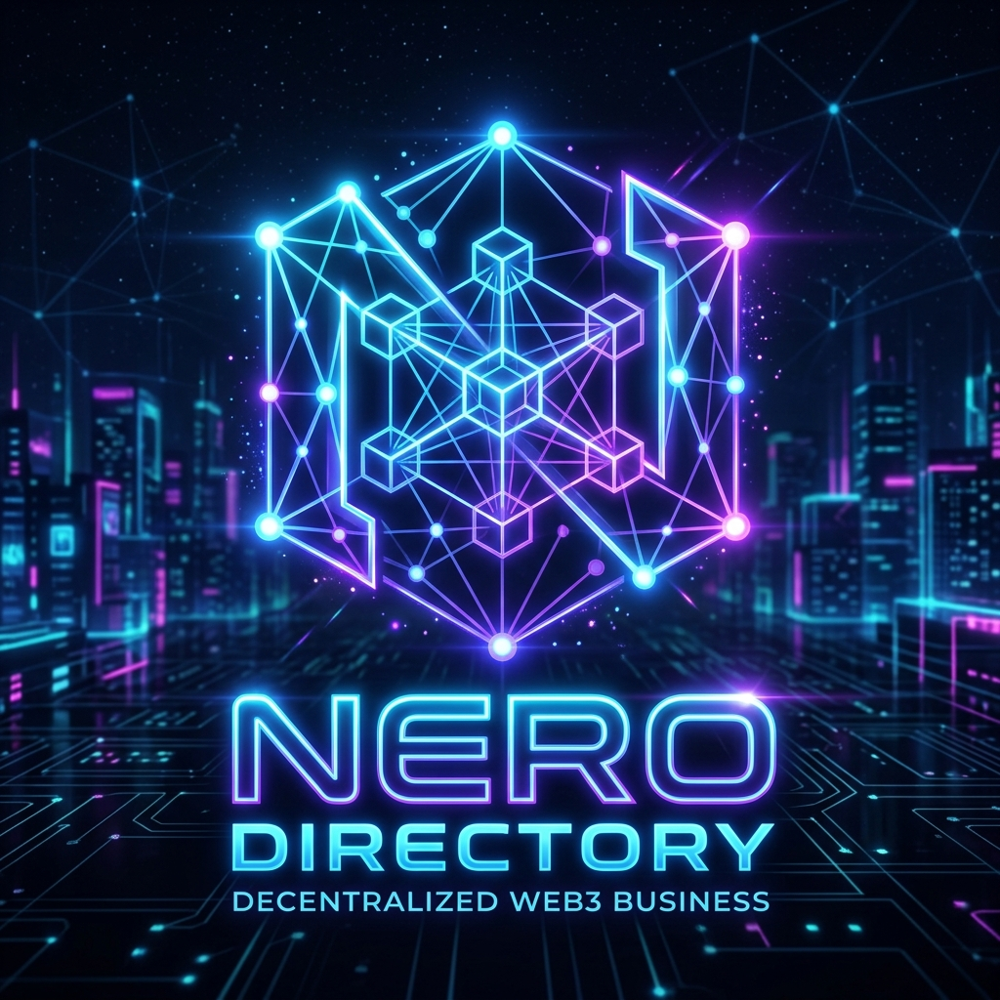

# directory_listing<div align="center">

  
  <h1>Nero Business Directory</h1>
  <p><strong>A Next-Generation Decentralized On-Chain Utility on the NERO Chain</strong></p>
</div>

```js
const CONTRACT_ADDRESS = "YOUR_CONTRACT_ADDRESS_AFTER_DEPLOYMENT";
const NETWORK = "NERO Testnet (Chain ID: YOUR_CHAIN_ID)";
```

---

## 👋 Welcome to the Nero Business Directory

🚀 **Nero Business Directory** is a Web3-powered decentralized application built on the **NERO Chain** to create a global, immutable directory of businesses.

Originally conceptualized for Stellar, the project has been successfully migrated to an **EVM-compatible architecture**, enabling seamless smart contract interaction and improved scalability.

The platform is designed on **trustless, peer-to-peer principles**, ensuring transparency, security, and decentralized verification.

---

## 🧑‍💻 Tech Stack

### 🧑‍🎓 Smart Contract Layer

- Developed using **Solidity**
- Deployed on the **NERO Testnet**
- Handles immutable CRUD operations and state changes
- Built and tested with **Hardhat**

### 🌱 Integration Layer

- Uses **ethers.js** for blockchain interaction
- Integrated with **MetaMask** for:
  - Wallet connection
  - Transaction signing
  - Network execution

### 💬 Architecture

- Fully **decentralized peer-to-peer verification system**
- No centralized backend

### 🚀 Frontend

- Built with **React 19 + Vite**
- Optimized for real-time blockchain data rendering

---

## 🌐 Decentralized Features

### 🔗 1. On-Chain Deployment

Users can create business listings directly on-chain, including metadata, location, and routing details.  
All data is **permanent, tamper-proof, and publicly verifiable**.

### ⭐ 2. Peer Consensus & Ratings

- Any connected wallet can act as a **rater/verifier**
- Trust and reputation are enforced via smart contract logic

### 🔐 3. Seamless Wallet Integration

- Automatically detects the NERO network
- Prompts users to switch or add the network if needed

---

## 🏗️ System Architecture Flow


### 1. Frontend Layer (React + Vite)

- **App Shell (`App.jsx`)**
  - Manages application state, wallet connection, and UI views

- **UI & Styling (`App.css`)**
  - Uses advanced CSS (`--mouse-x`, `--mouse-y`)
  - Enables smooth 3D and glow effects

- **State Management**
  - Uses React hooks (`useState`, `useEffect`, `useRef`)
  - Handles async blockchain interactions

---

### 2. Integration Layer (`lib/nero.js`)

- Connects frontend with blockchain
- Handles:
  - Wallet connection (`connectWallet`)
  - Network switching (`addAndSwitchNeroNetwork`)
- Provides async contract methods:
  - `createListing`
  - `updateListing`
  - `verifyListing`

---

### 3. Blockchain Layer (NERO Testnet / EVM)

- **Smart Contract (`DirectoryListing.sol`)**
  - Stores business data on-chain
  - Supports create, update, verify, and deactivate operations

- **Verification System**
  - Built into contract logic to ensure trust

---

## 🚀 Getting Started

### 📋 Prerequisites

- Node.js (latest stable version)
- MetaMask browser extension
- Testnet NERO tokens from faucet

---

### ⚙️ Installation

Clone the repository:

```bash
git clone https://github.com/pratyush06-aec/directorylisting_NERO.git
cd directory_listing
```

Install dependencies:

```bash
npm install
```

Run the development server:

```bash
npm run dev
```

Open in browser:
👉 http://localhost:5173

Ensure MetaMask is connected to the **NERO Testnet**.

---

## ⚙️ Smart Contract Deployment (For Developers)

1. Navigate to `evm-contracts` folder
2. Install dependencies:

```bash
npm install
```

3. Update `hardhat.config.js` with your private key

4. Deploy contract:

```bash
npx hardhat run scripts/deploy.js --network neroTestnet
```

5. Copy the deployed contract address and update:

```js
CONTRACT_ADDRESS;
```

inside `lib/nero.js`

---

<p align="center">
  <b>⭐ If you found this project useful, please consider giving it a star!</b>
</p>
